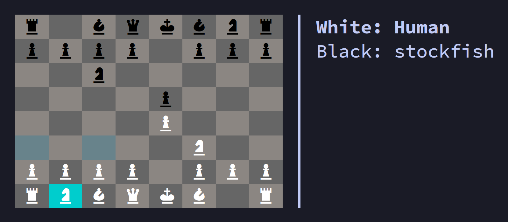

# Python Chess TUI Program

### Overview



A Python program that lets you play chess in the terminal, with support for UCI-compliant chess engines.

Requires [Blessed](https://github.com/jquast/blessed) for the TUI (since curses is archaic), and [click](https://github.com/pallets/click) for the command-line interface.

---

### Usage
```
Usage: run.py [OPTIONS]

  A simple Chess TUI.

  Use arrow keys to move cursor, press 'Space' to confirm,
  'Esc' to cancel and 'q' to quit.

  Engines used must be UCI compliant. If engines are not
  specified, player input will be used.

Options:
  -w, --white TEXT     Path of chess engine to play white
  -b, --black TEXT     Path of chess engine to play black
  -d, --depth INTEGER  Engine search depth, default 25
  -a, --ascii          Use ASCII characters for pieces instead of NerdFont
  --help               Show this message and exit.
```
---

### Other

Developed on Linux and tested with chess engines [stockfish](https://github.com/official-stockfish/Stockfish), [berserk](https://github.com/jhonnold/berserk) and [Bit-Genie](https://github.com/Aryan1508/Bit-Genie).
